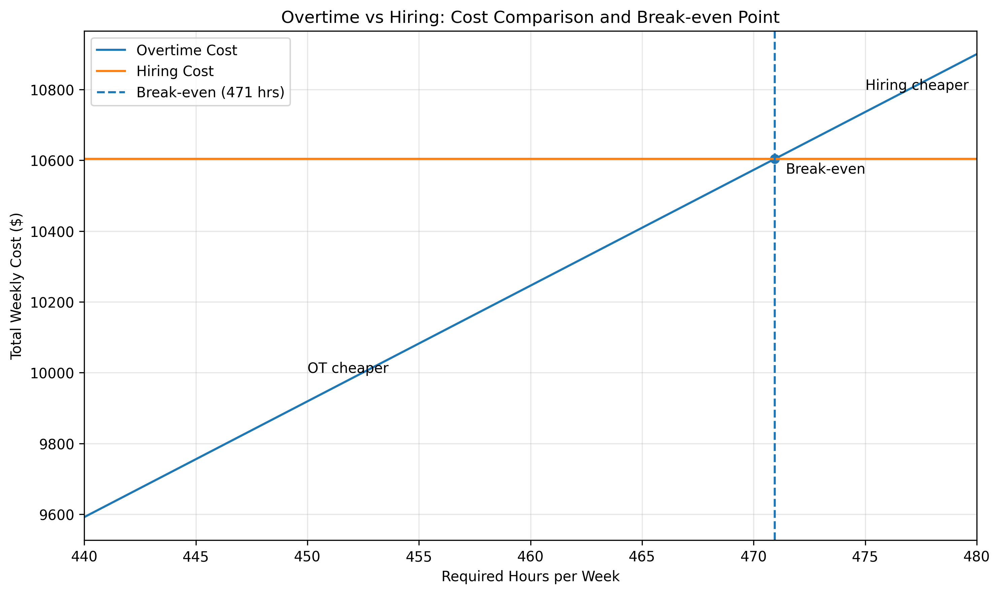

# Overtime vs Hiring Cost Analysis

## Overview

Compares overtime labor costs against hiring an additional full-time employee to identify the cost break-even point.

This model reflects a common workforce planning decision in payroll-heavy operations.

## Visualization

## Key Assumptions

- 40-hour workweek  
- Overtime paid at 1.5x  
- Employer tax: 9%  
- Health insurance: fixed weekly cost  
- Overtime applies to a subset of employees (e.g., junior staff)  
- Hiring adds one full-time employee (40 hours/week)  
- Hiring assumes no overtime (all employees work fixed schedules)  

## Approach

- Model total labor cost under two scenarios:
  1. Continue with overtime
  2. Hire an additional employee

- Costs include:
  - Base wages  
  - Overtime pay  
  - Employer taxes  
  - Benefits (fixed costs)

- Simulate different workload levels by increasing overtime hours

## Output

- Total labor cost under overtime vs hiring scenarios  
- Break-even point where hiring becomes more cost-effective  
- Visualization comparing both cost curves  

## Tech Stack

- Python  
- pandas  
- matplotlib  
- PostgreSQL  
